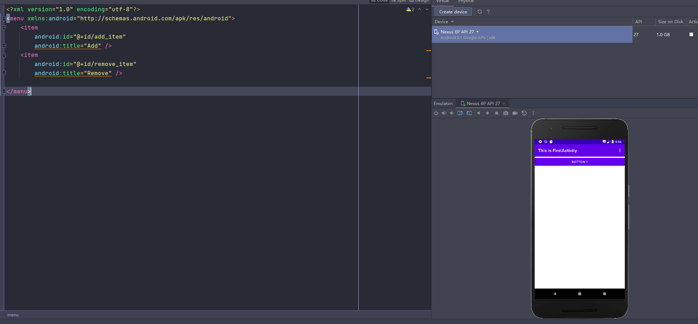
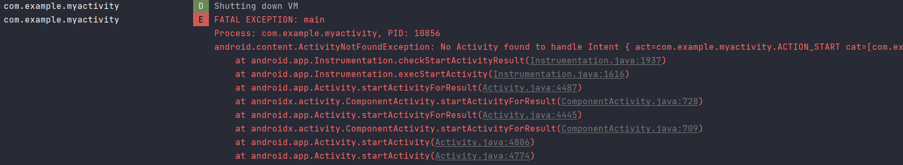

# AndroidDev-

《第一行代码》第三版练习记录

## 03.-Activity



使用Intent进行Activity之间的跳转

显式Intent

```kotlin
//            显示例Intent：定义intent，并启动activity，SecondActivity::class.java返回java class对象
            val intent = Intent(this, SecondActivity::class.java)
            startActivity(intent)
```

隐式Intent

利用action与category进行过滤

```xml
        <activity android:name=".SecondActivity"
            android:exported="true">
            <intent-filter>
                <action android:name="com.example.myactivity.ACTION_START" />
                DEFAULT是一种默认的category
                <category android:name="android.intent.category.DEFAULT" />
            </intent-filter>
        </activity>
```

如果添加一种自定义的category，情况如何

直接停止运行



更多的隐式Intent

```kotlin
//            parse方法将字符串解析为uri对象，SetData用于指定当前intent正在操作的数据
            intent.data = Uri.parse("https://www.baidu.com")
            startActivity(intent)
```

<data>标签可以配置许多过滤条件：scheme，协议；host，主机；port，端口；等

```xml
            <intent-filter tools:ignore="AppLinkUrlError">
                <action android:name="android.intent.action.VIEW" />
                <category android:name="android.intent.category.DEFAULT" />
                <data android:scheme="https" />
            </intent-filter>
```
